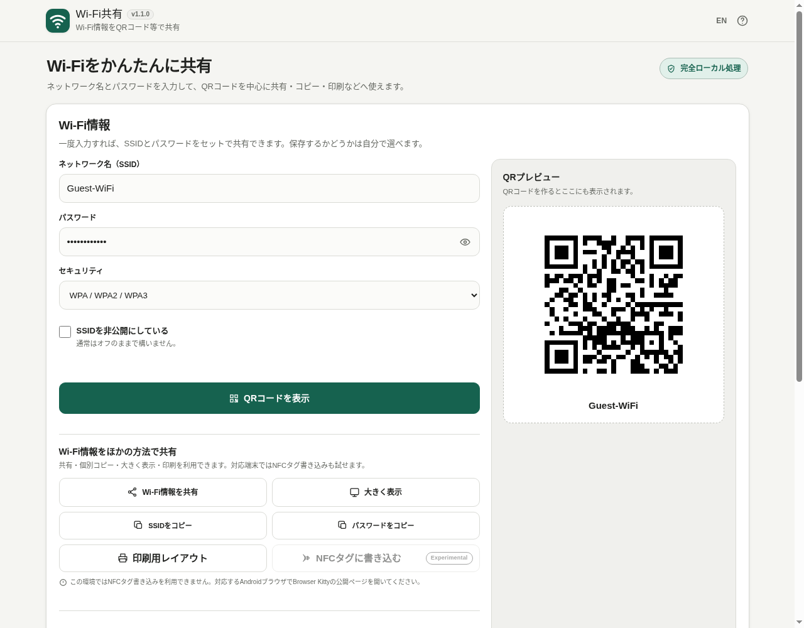

# Wi-Fi Share

[](https://github.com/ttomohisa/htmlapps-wifi-share/actions/workflows/deploy-pages.yml)
[](LICENSE)
[](https://ttomohisa.github.io/htmlapps-wifi-share/)

[English README](README.md)

Wi-Fi情報をQRコード等で共有する単一HTMLのブラウザツールです。端末の共有機能、SSID / パスワードの個別コピー、大きく表示、印刷用レイアウトに加え、対応環境ではExperimentalのNFCタグ書き込みも利用できます。SSIDやパスワードはブラウザ内で処理し、アプリのサーバーへアップロードしません。

## 🚀 デモ

### [GitHub PagesでWi-Fi Shareを開く](https://ttomohisa.github.io/htmlapps-wifi-share/)

GitHub Pagesから最初のHTMLを読み込んだ後、Wi-Fi QR生成、PNG作成、コピー、保存済みWi-Fiの管理はブラウザ内で処理します。Wi-Fi情報をアプリのサーバーへ送信する処理はありません。

[](https://ttomohisa.github.io/htmlapps-wifi-share/)

## Features

- **PNGファイル名を変更** — QR画像の保存・共有の前に名前を変更できます。初期名はSSIDから作り、`.png`を安全に補います。
- **QRコードで接続情報を共有** — WPA / WPA2 / WPA3 Personal、WEP、パスワードなし、非公開SSIDに対応したWi-Fi QRを生成します。
- **対応端末ではOS標準の共有機能を利用** — Web Share APIを使い、Wi-Fi情報や生成したQR画像を共有できます。
- **必要な情報だけコピー** — SSIDとパスワードを個別にコピーできます。
- **QRが使いにくい場面では大きく表示** — PCなどへ手入力しやすいよう、SSIDとパスワードをスマホ画面に大きく表示します。
- **印刷用レイアウト** — A4向けのWi-Fi案内を作成します。QRコードとSSIDを中心にし、パスワード印刷は必要な場合だけ有効にできます。
- **NFCタグ書き込み（Experimental）** — Web NFC対応のAndroidブラウザでは、Wi-Fi接続情報をNDEF対応タグへ書き込めます。
- **よく使うWi-Fiだけ端末内に保存** — 明示的に保存した場合だけ、このブラウザ内へWi-Fi情報を保存します。保存一覧にはパスワードを表示しません。
- **スマホで見せやすいUI** — 全画面QR、狭い画面向けレイアウト、対応環境ではScreen Wake Lockを利用します。
- **単一HTML・完全ローカル処理** — 日本語 / 英語UI、登録不要、実行時CDN依存なし、生成HTMLでは `connect-src 'none'` を設定しています。

## Quick start

### Web版を使う

[デモを開く](https://ttomohisa.github.io/htmlapps-wifi-share/)だけで利用できます。インストールやアカウント登録は不要です。

### 単一HTMLを作る

1. このリポジトリをダウンロードまたはcloneします。
2. Windowsで `build-standalone.bat` をダブルクリックするか、PowerShellから実行します。
3. `dist/index.html` が読みやすい通常の単一HTML版です。
4. `dist/index.self-extract.html` には、より小さい自己展開版が生成されます。

QR生成、コピーのフォールバック、大きく表示、PNG保存、印刷用レイアウトなどの基本機能はローカルHTMLでも利用できる設計です。Web Share、Screen Wake Lock、Web NFCなど、一部のWeb APIはHTTPSなどのSecure Contextを必要とします。

## Usage

1. ネットワーク名（SSID）を入力します。
2. パスワードを入力し、`WPA / WPA2 / WPA3`、`WEP`、`パスワードなし`からセキュリティ方式を選びます。
3. SSIDを非公開にしている場合だけ、非公開ネットワークを有効にします。
4. **QRコードを表示**を押し、接続したい端末のカメラで読み取ります。
5. QRが使いにくい場合は、端末の共有機能、SSID / パスワードの個別コピー、大きく表示を利用します。
6. 掲示したい場合は **印刷用レイアウト** を開き、A4で印刷します。パスワードの印刷は初期状態ではオフです。
7. 対応Androidブラウザでは **NFCタグに書き込む** からNDEF対応タグへ書き込めます（Experimental）。
8. 繰り返し使うWi-Fiは **このWi-Fiを保存** を選び、必要なら表示名を付けます。

QR画像の保存・共有前に、QR画面の **PNGファイル名** を変更できます。編集するまではSSIDに合わせて初期名が変わります。編集後の名前は、QR画面を開き直したりSSIDを変えたりしても、このページを閉じるまで保持します。空欄なら現在のSSIDを使います。ファイル名に使えない文字は置換し、重複する`.png`は取り除きます。

### 保存済みWi-Fi

保存機能は任意です。**このWi-Fiを保存** を押した場合だけ、このブラウザのlocalStorageへ保存します。一覧には表示名、SSID、セキュリティ方式を表示し、保存したパスワードは一覧に表示しません。保存済みWi-Fiは呼び出し・個別削除・全削除ができます。

ブラウザ内保存は、OSの保護された資格情報ストアへ保存する機能とは異なります。

## GitHub Pagesで公開する

このリポジトリには、単一HTMLをビルドして `dist` をGitHub Pagesへ公開するWorkflowが含まれています。

1. `htmlapps-wifi-share` としてGitHubへpushします。
2. **Settings → Pages → Build and deployment → Source** で **GitHub Actions** を選択します。
3. `main` へpushするか、Actionsから **Deploy standalone app to GitHub Pages** を実行します。
4. 成功すると `https://ttomohisa.github.io/htmlapps-wifi-share/` で利用できます。

Workflowではリポジトリ検証、通常単一HTML版・自己展開版の生成、`dist` のアップロードを行います。

## 開発・ビルド構成

```text
.
├─ APP_SPEC.md                   # アプリ仕様・受け入れ条件
├─ app.config.json               # アプリ情報・バージョン
├─ src/index.template.html       # アプリ本体テンプレート
├─ assets/favicon.svg            # アプリ / faviconアイコン
├─ dependencies.json             # 実行時依存の定義
├─ dependencies.lock.json        # 依存ロック
├─ build-standalone.bat          # Windows向けビルド入口
├─ build-standalone.ps1          # 単一HTMLビルダー
├─ scripts/                      # リポジトリ / ビルド検証
├─ dist/index.html               # 通常の単一HTML生成物
└─ dist/index.self-extract.html  # 自己展開単一HTML生成物
```

### Build

リポジトリの回帰テストにはNode.js 22以降が必要です。通常ビルドでは`dist/index.html`からルートの`wifi-share.html`も同じ内容に更新します。`-OutputPath`指定時はルートのHTMLを変更しません。

Windows PowerShell 7で:

```powershell
.\build-standalone.bat
```

ビルドでは以下を行います。

- `app.config.json` と依存定義の検証
- faviconとビルド情報の埋め込み
- `dist/index.html` の生成
- CSP、未解決プレースホルダー、埋め込みアセット、実行時通信制約の検証
- `dist/index.self-extract.html` の生成と検証
- `dist` 配下へのビルド / 依存マニフェスト出力

## Privacy / 実行時通信

生成HTMLのContent Security Policyには `connect-src 'none'` を設定しています。analytics、telemetry、外部フォント、CDN script、アプリ用バックエンドは使用しません。

SSID、パスワード、生成したQR情報は、ユーザーが明示的に次の操作をした場合を除いてブラウザ内に留まります。

- **端末の共有 / QR画像を共有** — 選択した内容をOSの共有シートへ渡します。その後の送信先はユーザーが選択します。
- **コピー** — 選択したSSIDまたはパスワードをクリップボードへ入れます。
- **このWi-Fiを保存** — この端末のブラウザのlocalStorageへWi-Fi情報を保存します。
- **PNG保存** — 生成したQR画像をファイルとして保存します。
- **印刷** — ブラウザの印刷機能へA4用レイアウトを渡します。
- **NFCタグ書き込み（Experimental）** — 対応環境で、ユーザーが明示的に開始したときだけNDEFタグへWi-Fi接続情報を書き込みます。

保存操作をしなければ、入力したWi-Fi情報を自動的に永続保存しません。

## Browser support

基本のQR生成は現在のChrome / Edge / Safari / FirefoxのPC・スマートフォンを対象としています。Web ShareとScreen Wake Lockは補助機能で、ブラウザ / OSの対応状況やSecure Context条件に依存します。Web NFCはExperimentalで対応範囲がさらに限定され、HTTPS上の対応Androidブラウザでのみ利用できます。

OSに保存されている現在のWi-Fiパスワードを読み取ることや、Webページから端末のWi-Fi設定を直接変更することはできません。QRを読み取った後の接続処理は、読み取り側の端末・OS・カメラ機能が行います。

## Limitations

- Enterprise / EAP Wi-Fiの設定には対応していません。
- Bluetooth / NFCによるスマホ間のWi-Fi情報直接転送は実装していません。NFCは対応端末からNDEFタグへ書き込むExperimental機能のみです。
- 現在接続中のSSIDやWi-FiパスワードをOSから自動取得できません。
- Web Share / Screen Wake Lock / Web NFCはすべてのブラウザや実行環境で利用できるわけではありません。
- NFCタグ書き込みはWEPと非公開SSIDを対象外とし、WPA3専用ネットワークの接続は保証しません。
- NFCタグへ書き込むと既存のNDEF内容は上書きされます。書き込んだタグを読める人はWi-Fi情報を利用できます。
- 保存済みWi-FiはブラウザのlocalStorageに保存します。サイトデータを削除すると消える場合があります。
- QRコード自体にWi-Fi接続情報が含まれるため、QRを読み取れる相手はそのネットワークへ接続できる可能性があります。
- Wi-Fi QRの読み取り後の互換性は、最終的に読み取り側端末とOSの実装に依存します。

## Dependencies

`dependencies.json` で宣言する実行時パッケージ依存はありません。QRエンコーダーはアプリソースへ直接同梱しており、Kazuhiko Arase氏のQR Code Generator for JavaScriptをベースとしたMIT Licenseのコードを使用しています。詳細は [THIRD_PARTY_NOTICES.md](THIRD_PARTY_NOTICES.md) を参照してください。

## Contributing

不具合報告や機能提案はGitHub Issuesで受け付けています。開発手順は [CONTRIBUTING.md](CONTRIBUTING.md) を参照してください。

## License

Copyright © 2026 ttomohisa

[MIT License](LICENSE) で公開しています。
