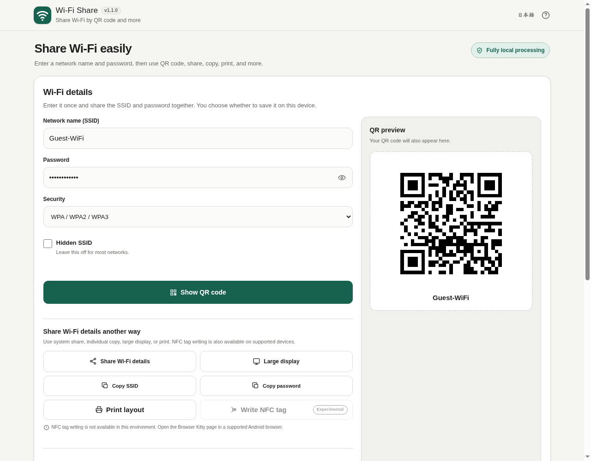

# Wi-Fi Share

[](https://github.com/ttomohisa/htmlapps-wifi-share/actions/workflows/deploy-pages.yml)
[](LICENSE)
[](https://ttomohisa.github.io/htmlapps-wifi-share/)

[日本語版 README](README.ja.md)

A single-HTML browser app for sharing Wi-Fi details by QR code and related methods. It also includes an A4 print layout and Experimental NFC tag writing on supported Web NFC environments. The SSID and password are processed in the browser and are not uploaded by the app.

## 🚀 Live demo

### [Open Wi-Fi Share on GitHub Pages](https://ttomohisa.github.io/htmlapps-wifi-share/)

GitHub Pages delivers the initial HTML. After it loads, Wi-Fi QR generation, PNG creation, copy operations, and saved-profile handling run locally in the browser. Wi-Fi credentials are not sent to an application server.

[](https://ttomohisa.github.io/htmlapps-wifi-share/)

## Features

- **Connect by QR code** — Generate Wi-Fi QR codes for WPA/WPA2/WPA3 Personal, WEP, open networks, and hidden SSIDs.
- **Use the phone's share sheet when available** — Send the Wi-Fi details or a generated QR PNG through the browser's Web Share API.
- **Copy only what you need** — Copy the SSID and password separately for manual setup.
- **Show details at a distance** — Display the SSID and password in a large, phone-friendly view when QR scanning is not practical.
- **Print layout** — Create an A4 Wi-Fi sign centered on the QR code and SSID, with password printing off by default.
- **NFC tag writing (Experimental)** — On supported Android Web NFC browsers, write Wi-Fi connection details to an NDEF-compatible NFC tag.
- **Keep frequently used networks on this device** — Save a Wi-Fi profile only when you explicitly choose to; saved passwords are not shown in the profile list.
- **Designed for phone-to-phone use** — Full-screen QR display, responsive layouts from narrow phones upward, and Screen Wake Lock when the browser supports it.
- **Private, single-HTML operation** — Japanese/English UI, no account, no CDN runtime dependency, and `connect-src 'none'` in the generated app.

## Quick start

### Use the web demo

Just [open the demo](https://ttomohisa.github.io/htmlapps-wifi-share/). No installation or account is required.

### Build the single HTML file

1. Download or clone this repository.
2. On Windows, double-click `build-standalone.bat`, or run it from PowerShell.
3. Use the generated `dist/index.html` as the readable single-file app.
4. `dist/index.self-extract.html` is the smaller self-extracting variant.

The generated app does not need a local web server for the core QR, copy fallback, large-display, PNG-save, and print-layout flows. Web Share, Screen Wake Lock, and Web NFC can require HTTPS or another secure context.

## Usage

1. Enter the network name (SSID).
2. Enter the password and choose `WPA / WPA2 / WPA3`, `WEP`, or `No password`.
3. Enable the hidden-network option only when the SSID is hidden.
4. Choose **Show QR code** and scan it with the other device.
5. If QR scanning is not practical, use system share, copy the SSID/password separately, or open the large-display view.
6. To post the network details, open **Print layout** and print the A4 Wi-Fi sign. Password printing is off by default.
7. On supported Android browsers, use **Write NFC tag** to write the network to an NDEF-compatible tag (Experimental).
8. For a network you use repeatedly, choose **Save this Wi-Fi** and optionally give it a display name.

### Saved Wi-Fi profiles

Saved profiles are optional. The app stores them in this browser's local storage only after you explicitly save them. The list shows the display name, SSID, and security type, but does not reveal the stored password. You can load, delete, or clear saved profiles from the same device.

Saving a Wi-Fi profile in browser storage is not the same as storing it in the operating system's protected credential manager.

## Publish with GitHub Pages

The repository includes a workflow that builds the standalone HTML and deploys `dist` to GitHub Pages.

1. Push the repository to GitHub as `htmlapps-wifi-share`.
2. Open **Settings → Pages → Build and deployment → Source** and select **GitHub Actions**.
3. Push to `main`, or manually run **Deploy standalone app to GitHub Pages** from the Actions tab.
4. After a successful deployment, the demo is available at `https://ttomohisa.github.io/htmlapps-wifi-share/`.

The workflow validates the repository, builds the readable and self-extracting HTML files, and uploads the generated `dist` directory.

## Development and build layout

```text
.
├─ APP_SPEC.md                   # Product requirements and acceptance criteria
├─ app.config.json               # App metadata and version
├─ src/index.template.html       # Application source template
├─ assets/favicon.svg            # App and favicon artwork
├─ dependencies.json             # Runtime dependency declaration
├─ dependencies.lock.json        # Resolved dependency lock
├─ build-standalone.bat          # Windows build entry point
├─ build-standalone.ps1          # Standalone HTML builder
├─ scripts/                      # Repository/build verification scripts
├─ dist/index.html               # Readable generated single HTML
└─ dist/index.self-extract.html  # Self-extracting generated single HTML
```

### Build

On Windows PowerShell 7:

```powershell
.\build-standalone.bat
```

The build process:

- validates `app.config.json` and dependency metadata
- embeds the app favicon and required build metadata
- generates `dist/index.html`
- verifies CSP, placeholders, embedded assets, and runtime-network restrictions
- generates and verifies `dist/index.self-extract.html`
- writes build and dependency manifests under `dist/`

## Privacy and runtime network protection

The generated app includes a Content Security Policy with `connect-src 'none'`. It does not use analytics, telemetry, external fonts, CDN scripts, or an application backend.

SSID, password, and generated QR data stay in the browser unless you explicitly perform an action that sends or stores them:

- **System share / QR image share** passes the selected content to the operating system share sheet. What happens after that depends on the destination you choose.
- **Copy** places the selected SSID or password on the clipboard.
- **Save this Wi-Fi** stores that profile in this browser's local storage on the current device.
- **PNG save** writes the generated QR image to a file you choose.
- **Print** sends the A4 Wi-Fi sign to the browser print dialog.
- **NFC tag writing (Experimental)** writes Wi-Fi connection details to an NDEF tag only after explicit user action in a supported environment.

If you do not save a profile, the app does not persist the entered Wi-Fi credentials automatically.

## Browser support

Core QR generation is designed for current Chrome, Edge, Safari, and Firefox on desktop and mobile. Web Share and Screen Wake Lock are optional enhancements. Web NFC is Experimental and limited to supported Android browsers over HTTPS. Unsupported optional features do not block the QR workflow.

The app cannot read the Wi-Fi password currently stored by the operating system and cannot directly change the device's Wi-Fi settings. QR scanning and final Wi-Fi connection are handled by the receiving device and its OS/camera implementation.

## Limitations

- Enterprise/EAP Wi-Fi provisioning is not supported.
- Bluetooth or NFC peer-to-peer phone-to-phone Wi-Fi credential transfer is not implemented. NFC support is limited to Experimental writing to compatible NDEF tags.
- The page cannot automatically read the current SSID or Wi-Fi password from the OS.
- Web Share, Screen Wake Lock, and Web NFC are not available in every browser or context.
- NFC tag writing excludes WEP and hidden SSIDs, and WPA3-only connectivity is not guaranteed.
- Writing an NFC tag overwrites its existing NDEF contents. Anyone who can read the tag can use the Wi-Fi details stored on it.
- Saved profiles use browser local storage, not the OS credential manager. Clearing site data can remove them.
- A QR code contains the Wi-Fi connection information; anyone who can scan or inspect it may be able to join that network.
- Compatibility of a scanned Wi-Fi QR code ultimately depends on the receiving device and OS.

## Dependencies

The app has no runtime package dependencies declared in `dependencies.json`. The QR encoder code is bundled directly in the application source and is based on Kazuhiko Arase's QR Code Generator for JavaScript under the MIT License. See [THIRD_PARTY_NOTICES.md](THIRD_PARTY_NOTICES.md) for details.

## Contributing

Bug reports and feature proposals are welcome through GitHub Issues. See [CONTRIBUTING.md](CONTRIBUTING.md) for development guidance.

## License

Copyright © 2026 ttomohisa

Licensed under the [MIT License](LICENSE).
